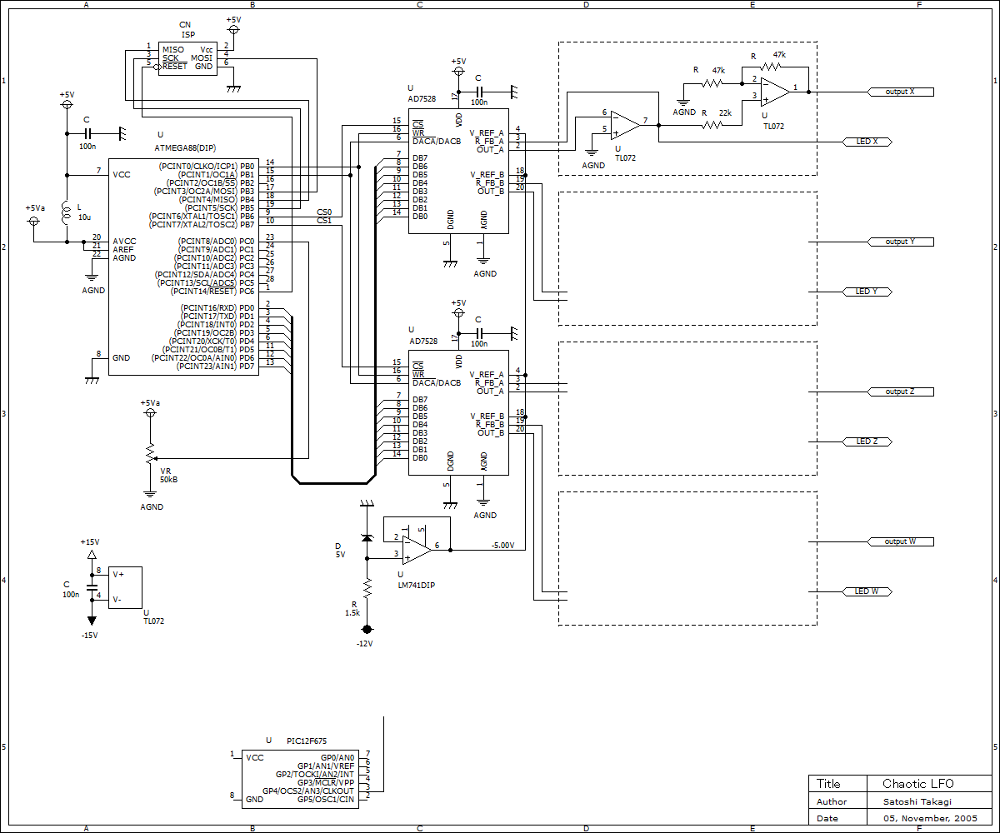

# ChaoticLFO1

[Chatic LFO - DIY Fx and Synthesizer](https://scrapbox.io/diyfx/Chatic_LFO)

Chaos信号生成をLFOとして実装してみたもの．

マイコン（ATmega88）で演算し，バスI/OでDAコンバータ（AD7528）を介してカオス信号 X，Y，Z，W を得ている．なおWは単なるLamp信号．
なおカオス電圧について[色で電圧を表現する](https://scrapbox.io/diyfx/%E8%89%B2%E3%81%A7%E9%9B%BB%E5%9C%A7%E3%82%92%E8%A1%A8%E7%8F%BE%E3%81%99%E3%82%8B)  ためにPICマイコン＋フルカラーLEDも併せて実装されている．

下の飛び地のPICは[色で電圧を表現する](https://scrapbox.io/diyfx/%E8%89%B2%E3%81%A7%E9%9B%BB%E5%9C%A7%E3%82%92%E8%A1%A8%E7%8F%BE%E3%81%99%E3%82%8B) ([ChuckTimber/vmeter](https://github.com/ChuckTimber/vmeter)
) を実装したものを完成済みブロックとして出力チャネルの分だけ置いているという意味合い．